# Načrtovanje, optimizacija in FEM verifikacija 6-polnega sinhronskega motorja z vzbujalnim navitjem

**Seminarska naloga pri predmetu Konstruiranje električnih strojev**
Fakulteta za elektrotehniko, Univerza v Ljubljani

---

## Kazalo

1. [Uvod](#1-uvod)
2. [Vhodni podatki in cilji](#2-vhodni-podatki-in-cilji)
3. [Arhitektura programa](#3-arhitektura-programa)
4. [Analitični izračun (A–F)](#4-analitični-izračun-a–f)
   - 4.1 [Predpostavke in nazivni preračun](#41-predpostavke-in-nazivni-preračun)
   - 4.2 [Tangencialna obremenitev in zračna reža](#42-tangencialna-obremenitev-in-zračna-reža)
   - 4.3 [Število ovojev in faktor navitja](#43-število-ovojev-in-faktor-navitja)
   - 4.4 [Statorski tok in dimenzije zoba](#44-statorski-tok-in-dimenzije-zoba)
   - 4.5 [Statorski jarem](#45-statorski-jarem)
   - 4.6 [Rotorska geometrija in vzbujalni tok](#46-rotorska-geometrija-in-vzbujalni-tok)
   - 4.7 [Železove izgube — polinomska aproksimacija](#47-železove-izgube--polinomska-aproksimacija)
   - 4.8 [Bakrene izgube](#48-bakrene-izgube)
   - 4.9 [Izkoristek](#49-izkoristek)
5. [Optimizacija z genetskim algoritmom (G–H–K)](#5-optimizacija-z-genetskim-algoritmom-g–h–k)
   - 5.1 [Pregled NSGA-II](#51-pregled-nsga-ii)
   - 5.2 [Optimizacijske spremenljivke](#52-optimizacijske-spremenljivke)
   - 5.3 [Ciljne funkcije in omejitve](#53-ciljne-funkcije-in-omejitve)
   - 5.4 [Pareto fronta](#54-pareto-fronta)
   - 5.5 [Izbor 5 reprezentativnih rešitev](#55-izbor-5-reprezentativnih-rešitev)
6. [Parametrični FEMM model (I–J)](#6-parametrični-femm-model-i–j)
   - 6.1 [Statorska geometrija](#61-statorska-geometrija)
   - 6.2 [Rotorska geometrija s sinusno zaokrožitvijo](#62-rotorska-geometrija-s-sinusno-zaokrožitvijo)
   - 6.3 [Razporeditev statorskih navitij](#63-razporeditev-statorskih-navitij)
   - 6.4 [Materiali, krogotoki in robni pogoji](#64-materiali-krogotoki-in-robni-pogoji)
7. [FEMM simulacije (L–M)](#7-femm-simulacije-l–m)
   - 7.1 [Prosti tek in inducirana napetost](#71-prosti-tek-in-inducirana-napetost)
   - 7.2 [Navorne karakteristike](#72-navorne-karakteristike)
   - 7.3 [FFT analiza navora](#73-fft-analiza-navora)
   - 7.4 [Izgube v železu iz FEMM](#74-izgube-v-železu-iz-femm)
8. [Rezultati 5 izbranih rešitev (N)](#8-rezultati-5-izbranih-rešitev-n)
   - 8.1 [Povzetek](#81-povzetek)
   - 8.2 [D01 — max_eta](#82-d01--max_eta)
   - 8.3 [D02 — high_eta_mid](#83-d02--high_eta_mid)
   - 8.4 [D03 — mid](#84-d03--mid)
   - 8.5 [D04 — low_eta_mid](#85-d04--low_eta_mid)
   - 8.6 [D05 — min_V (Pareto idx 15, avtomatska zamenjava)](#86-d05--min_v-pareto-idx-15-avtomatska-zamenjava)
9. [Kritična ocena](#9-kritična-ocena)
10. [Tabela simbolov](#10-tabela-simbolov)
11. [Reference](#11-reference)

---

## 1. Uvod

Naloga zahteva razvoj programskega orodja (Python), ki:

1. **Analitično dimenzionira** 6-polni sinhronski motor z vzbujalnim navitjem iz vhodnih podatkov.
2. **Optimizira stroj** z genetskim algoritmom NSGA-II glede na dva nasprotujoča cilja:
   - **maksimizacija izkoristka** $\eta$,
   - **minimizacija volumna aktivnega dela** $V_{\text{active}}$.
3. Iz **Pareto fronte** izbere 5 reprezentativnih rešitev.
4. Vsako rešitev **parametrično izriše v programu FEMM 4.2** preko Python ovojnice `pyFEMM` in jo numerično preveri:
   - **prosti tek** — izračun inducirane napetosti $U_{\text{ind}}$ pri vogalni hitrosti,
   - **navor** — izračun nazivnega navora in njegove harmonske vsebine.
5. Pripravi grafe, tabele in povzetke za to poročilo.

Vse korake izvaja Python program v repozitoriju, struktura katerega je opisana v razdelku 3.

> **Opomba o uporabi UI:** Pri pisanju kode in tega poročila je bila uporabljena umetna inteligenca. Vse enačbe, postopki in algoritmi so podprti z referencami na znanstveno literaturo (glej razdelek 11). Vsaka funkcija v izvorni kodi ima docstring z razlago in opozorilom na vir.

---

## 2. Vhodni podatki in cilji

### 2.1 Nazivni podatki stroja

| Količina | Simbol | Vrednost | Enota |
|----------|--------|----------|-------|
| Število faz | $m$ | 3 | — |
| Število polovih parov | $p$ | 3 | — |
| Število polov | $2p$ | 6 | — |
| Fazna napetost (RMS) | $U_f$ | 200 | V |
| Nazivna moč v vogalni točki | $P_c$ | 50 000 | W |
| Vogalna mehanska hitrost | $n_c$ | 7 000 | vrt/min |
| Najvišja obratovalna hitrost | $n_{\max}$ | 14 000 | vrt/min |
| Material lameliranja | M330-35A | (Sura/Cogent) | — |
| Predpostavljen $\cos\varphi$ | — | 0.95 | — |

### 2.2 Izvedene nazivne količine

Mehanska in električna kotna hitrost:

$$
\omega_{\text{meh}} = \frac{2\pi n_c}{60} = \frac{2\pi \cdot 7000}{60} \approx 733{,}04 \text{ rad/s}
$$

$$
\omega_{\text{el}} = p \cdot \omega_{\text{meh}} \approx 2199{,}1 \text{ rad/s}
$$

Električna frekvenca v vogalni točki:

$$
f_c = \frac{n_c \cdot p}{60} = \frac{7000 \cdot 3}{60} = 350 \text{ Hz}
$$

Nazivni navor v vogalni točki:

$$
M_c = \frac{P_c}{\omega_{\text{meh}}} = \frac{50000}{733{,}04} \approx 68{,}21 \text{ Nm}
$$

Pri $n_{\max} = 14\,000$ vrt/min je frekvenca $f_{\max} = 700$ Hz; v poročilu obdelamo le vogalno točko, ker je tam moč nazivno definirana.

### 2.3 Cilji naloge

- Točka **A**: analitičen preračun celotne geometrije stroja.
- Točka **B**: $B_\delta(I_m, \Theta_m)$.
- Točka **C**: polinomska aproksimacija izgub v železu $p_{Fe}(B, f)$.
- Točka **D**: izgube v železu po delih (zob, jarem).
- Točka **E**: bakrene izgube $P_{Cu}$.
- Točka **F**: izkoristek $\eta$.
- Točka **G**: GA vključen v analitični preračun.
- Točka **H**: Pareto fronta (max $\eta$, min $V$).
- Točka **I**: FEMM parametrični model.
- Točka **J**: materiali, navitja, mreženje.
- Točka **K**: izbor 5 Pareto optimalnih rešitev.
- Točka **L**: prosti tek, $U_{\text{ind}}$.
- Točka **M**: navor in FFT.
- Točka **N**: komentar 5 rešitev.

---

## 3. Arhitektura programa

Program je strukturiran kot **modularni cevni tok (pipeline)**:

```
[inputs.py]  →  [analytical.py]  →  [optimization.py]  →  [pareto.py]
                                                              │
                                                              ▼
                                              [femm_model.py] → [femm_sim.py]
                                                              │
                                                              ▼
                                                          [post.py]
                                                              │
                                                              ▼
                                              [plot.py]   [results.csv / JSON]
```

| Modul | Vloga |
|-------|-------|
| `src/inputs.py` | Privzeti nazivni podatki, lastnosti materialov, meje GA, EMETOR tabela $q \to (Q_s, k_{w1})$. |
| `src/losses.py` | Polinomska aproksimacija specifičnih izgub M330-35A (točka C). |
| `src/analytical.py` | Razred `MotorDesign`, funkcija `analyze()` izvede točke A–F. |
| `src/optimization.py` | `MotorOptimizationProblem` ovojnica za NSGA-II preko `pymoo`. |
| `src/pareto.py` | Izbor 5 rešitev s Pareto fronte. |
| `src/femm_model.py` | Parametrični izris geometrije v FEMM. |
| `src/femm_sim.py` | Vodenje simulacij prostega teka in navora. |
| `src/post.py` | $P_{Fe}$ iz FEMM, $U_{\text{ind}}$ spekter, THD, primerjava analitika↔FEMM. |
| `src/plot.py` | Vsi grafi v 300 dpi. |
| `src/main.py` | Orkestrira faze 1–2 (analitika + GA). |
| `src/run_femm_pareto.py` | Orkestrira faze 3–4 (FEMM + post). |

Skupno **58 pytest testov** v `tests/` preverja pravilnost analitičnih formul, GA, izborni mehanizem in post-procesiranje.

---

## 4. Analitični izračun (A–F)

### 4.1 Predpostavke in nazivni preračun

Izhodišče je magnetni in električni preračun po Pyrhönen et al. [1, §6]. Bistvene predpostavke:

- **Sinusna prostorska razporeditev polja** v zračni reži, kar daje faktor pretvorbe $\alpha_p = 2/\pi$ med amplitudo $B_\delta$ in povprečno vrednostjo na polovem koraku.
- **Faktor navitja** $k_{w1}$ vzet z EMETOR tabele [4] za 3-fazni stroj, $2p=6$, izbrane vrednosti $q \in \{1, 1.5, 2, 2.5, 3\}$:
  - $q=1: Q_s=18, k_{w1}=0{,}9598$
  - $q=1{,}5: Q_s=27, k_{w1}=0{,}9452$
  - $q=2: Q_s=36, k_{w1}=0{,}9659$
  - $q=2{,}5: Q_s=45, k_{w1}=0{,}9531$
  - $q=3: Q_s=54, k_{w1}=0{,}9598$
- **Polnilni faktor lameliranja** $k_{Fe}=0{,}97$.
- **Faktor zapolnitve statorskega utora** $K_{Cu,s}=0{,}38$ (vir: priložena MATLAB skripta).
- **Faktor zapolnitve rotorskega utora** $K_{Cu,r}=0{,}60$ (predpostavljeno).
- **Carter koeficient** se izračuna iterativno (zaprta enačba) z začetno oceno $K_c=1{,}17$.
- **Faktor nasičenja** $k_{\text{sat}}=1{,}10$ (Pyrhönen §3.5).

### 4.2 Tangencialna obremenitev in zračna reža

Število utorov sledi iz topologije:

$$
Q_s = 2 \cdot p \cdot m \cdot q
$$

Polov korak (na rotorskem oboda):

$$
\tau_p = \frac{\pi D_r}{2p}
$$

Rotorski volumen (aktivni del):

$$
V_r = \pi \left(\frac{D_r}{2}\right)^2 L_r
$$

**Tangencialna obremenitev** (specifični strižni navor) je sila/površina, ki jo zrak prenese:

$$
\sigma_F = \frac{M_c}{2 V_r} = \frac{2 M_c}{\pi D_r^2 L_r}
$$

[Pyrhönen, eq. 6.2 in 6.4]

**Linearna tokovna obloga** $A$ (Pyrhönen eq. 6.5, peak vrednost):

$$
A = \frac{\sqrt{2}\,\sigma_F}{B_\delta \cos\varphi}
$$

Iz tega in vzdolž Pyrhönen empirične zveze izhaja **minimalna zračna reža**:

$$
\delta = \frac{1}{K_c} \cdot \gamma \cdot \tau_p \cdot \frac{A}{B_\delta} \cdot k_{\text{sat}}
$$

kjer je $\gamma \approx 4 \cdot 10^{-7}$ m·m/A empirična konstanta (kombinirano iz $\mu_0/\pi$ in faktorjev geometrije, izpeljano v [1, §3.5]; identično uporabljeno v lanski seminarski [primer1]).

**Carter koeficient** dobimo po Pyrhönen eq. 3.62 z iteracijo:

$$
K_b = \frac{b_1/\delta}{5 + b_1/\delta}, \quad b_e = K_b \cdot b_1, \quad K_c = \frac{\tau_u}{\tau_u - b_e}
$$

Skupni $K_c = K_{c,s} \cdot K_{c,r}$ (stator + rotor). Statorska utorna odprtina $b_{1s}=4$ mm, rotorska $b_{1r} = (1-\alpha_p^r)\tau_p$ kjer je $\alpha_p^r$ delež širine pola.

Po Carterju ponovno izračunamo $\delta$. **Klampamo $\delta \ge 0{,}3$ mm** kot tehnološko spodnjo mejo (izdelava lamel).

### 4.3 Število ovojev in faktor navitja

Inducirana napetost (1. harmonska) sinusnega stroja [Pyrhönen eq. 7.31]:

$$
E_{f1} = \sqrt{2}\, \pi f \, k_{w1} N_s \, \alpha_p B_\delta \tau_p L_r
$$

Z $\omega_{\text{el}} = 2\pi f$ in zahtevo $E_{f1} = U_f$:

$$
N_s = \frac{\sqrt{2}\, U_f}{\omega_{\text{el}}\, \alpha_p \, B_\delta \, \tau_p \, L_r \, k_{w1}}
$$

Število ovojev v enem utoru:

$$
Z_q = \left\lceil \frac{2 m N_s}{Q_s} \right\rceil
$$

Zaokrožimo navzgor in popravimo $N_s$:

$$
N_s = \frac{Z_q \cdot Q_s}{2m}
$$

Dejanska gostota $B_\delta^{\text{eff}}$ (po zaokroževanju $N_s$):

$$
B_\delta^{\text{eff}} = \frac{\sqrt{2}\, U_f}{\omega_{\text{el}}\, \alpha_p \, N_s \, \tau_p \, L_r \, k_{w1}}
$$

### 4.4 Statorski tok in dimenzije zoba

Statorski (fazni) tok:

$$
I_n = \frac{P_c}{m \cdot \eta_0 \cdot \cos\varphi \cdot U_f}
$$

kjer je $\eta_0 = 0{,}95$ začetna ocena (na koncu se iz dobljenih izgub preveri).

Presek enega statorskega vodnika:

$$
S_{Cu,s} = \frac{I_n}{J_{Cu,s}}
$$

(gostota toka $J_{Cu,s}$ je optimizacijska spremenljivka, omejena ≤ 10 A/mm² po nalogi).

**Širina statorskega zoba** sledi iz pogoja, da je fluks v zobu enak fluksu v utornem koraku [Pyrhönen §7.4]:

$$
B_{\delta}^{\text{hom}} \cdot \tau_u \cdot L_r = B_{ds} \cdot b_{ds} \cdot k_{Fe} \cdot L_r
$$

kjer $B_\delta^{\text{hom}} = B_\delta^{\text{eff}} / K_c$ je "homogenizirana" gostota (povprečje nad obtokom utora). Reševanje:

$$
b_{ds} = \frac{B_\delta^{\text{eff}} \cdot \tau_u}{B_{ds} \cdot k_{Fe}}
$$

kjer je $\tau_u = \pi (D_r + 2\delta)/Q_s$ utorni korak v zr. reži.

Površina, potrebna za vse $Z_q$ vodnike v utoru:

$$
S_{us} = \frac{Z_q \cdot S_{Cu,s}}{K_{Cu,s}}
$$

Privzeto je utor pravokoten s širino $b_s = \tau_u - b_{ds}$ (na zr. reži). **Višina utora** je iterativno določena tako, da zadošča potreba po preseku:

$$
h_{ds} = \frac{S_{us}}{b_s^{\text{avg}}}
$$

V FEMM modelu je dejanski utor trapezoiden (zaradi prilegajočega zoba s konstantno širino), zato $b_s^{\text{avg}}$ predstavlja povprečno širino utora.

### 4.5 Statorski jarem

Maksimalni fluks na pol [Pyrhönen eq. 7.4]:

$$
\Phi_{\text{pole}} = \alpha_p \cdot B_\delta^{\text{eff}} \cdot \tau_p \cdot L_r
$$

V statorskem jarmu polovica fluksa potuje skozi vsako polovico jarma (krožni obtok):

$$
h_{ys} = \frac{\Phi_{\text{pole}}}{2 \cdot k_{Fe} \cdot L_r \cdot B_{sy}}
$$

Zunanji premer statorja (vključuje višino zoba, jarma, izolacijski podloga in zagozdo):

$$
D_{si} = D_r + 2\delta
$$
$$
D_{se} = D_{si} + 2 h_{ds} + 2 h_{ys}
$$

(v FEMM modelu dodamo še debelini izolacije in zagozde, vendar te ne sodelujejo v magnetnem izračunu).

**Aktivni volumen** (cilj GA):

$$
V_{\text{active}} = \pi \left(\frac{D_{se}}{2}\right)^2 L_r
$$

### 4.6 Rotorska geometrija in vzbujalni tok

Rotorski zob nosi celoten polov fluks. Z istim postopkom kot za statorski zob:

$$
b_{dr} = \frac{B_\delta^{\text{eff}} \cdot \tau_p \cdot \alpha_p}{B_{dr} \cdot k_{Fe}}
$$

(privzeto $B_{dr} = B_{ds}$, ker oba elementa nosita podobno gostoto.)

Rotorski jarem podobno kot statorski:

$$
h_{yr} = \frac{\Phi_{\text{pole}}}{2 \cdot k_{Fe} \cdot L_r \cdot B_{sy}}
$$

**Točka B — vzbujalna magnetna napetost** in **vzbujalni tok**:

Magnetna napetost (ampere-ovoji), ki vzdržuje $B_\delta$ čez efektivno zr. režo:

$$
F_m = \frac{B_\delta^{\text{eff}}}{\mu_0} \cdot \delta_{\text{eff}}, \quad \delta_{\text{eff}} = K_c \cdot \delta \cdot k_{\text{sat}}
$$

Vzbujalni tok (DC) pri $N_r$ ovojev na pol:

$$
I_m = \frac{F_m}{N_r}
$$

Funkcijska odvisnost $B_\delta(I_m, \Theta_m)$ izhaja iz reverza:

$$
B_\delta = \frac{\mu_0 \cdot N_r \cdot I_m}{\delta_{\text{eff}}} = \frac{\mu_0 \cdot \Theta_m}{\delta_{\text{eff}}}
$$

kjer $\Theta_m = N_r \cdot I_m$ je vzbujalna magnetna napetost. Pri nasičenosti (linearen B-H ni več veljaven) bi formulo morali popraviti z B-H krivuljo $H(B)$; v FEMM modelu je to avtomatsko upoštevano preko priložene B-H tabele iz `BH.txt`.

Presek vzbujalnega vodnika:

$$
S_{Cu,r} = \frac{I_m}{J_{Cu,r}}
$$

(omejeno na ≤ 5 A/mm² po nalogi).

### 4.7 Železove izgube — polinomska aproksimacija

**Točka C — polinom $p_{Fe}(B, f)$ za M330-35A:**

Sura Cogent ponuja tabelo specifičnih izgub po točkah $(B, f, p)$ pri frekvencah 50, 100, 200, 400 Hz in $B \in [0; 1{,}8]$ T. Priložena MATLAB koda (`izgube_fem.txt`) uporabi MATLAB `fit(..., 'poly23')`. V Pythonu uporabimo ekvivalent z `numpy.linalg.lstsq` na osnovi vseh členov:

$$
p_{Fe}(B, f) = \sum_{i=0}^{2} \sum_{j=0}^{3} c_{ij} \cdot B^i \cdot f^j \quad \text{[W/kg]}
$$

Skupno **12 koeficientov** $c_{ij}$ se naučijo iz tabele 70 podatkovnih točk z metodo najmanjših kvadratov. Rezultat fitanja:

- **RMSE = 0,756 W/kg** na celem območju 0–70 W/kg.
- Točnost na referenčnih točkah:

| $B$ [T] | $f$ [Hz] | tabela [W/kg] | polinom [W/kg] | odstopanje |
|---------|----------|--------------|----------------|-----------|
| 1,0 | 50 | 1,22 | 1,231 | +0,9 % |
| 1,5 | 50 | 2,94 | 3,087 | +5,0 % |
| 1,0 | 100 | 3,07 | 3,146 | +2,5 % |
| 1,5 | 200 | 19,6 | 19,394 | -1,1 % |
| 1,0 | 350 | (interp.) | 19,6 | — |
| 1,5 | 350 | (interp.) | 46,5 | — |

Vrednosti pri $f = 350$ Hz so **interpolirane** (med 200 in 400 Hz) — leži ravno znotraj veljavnega območja.

**Točka D — izgube po delih statorja:**

Volumen vseh statorskih zob (skupna prostornina železa v zobnih stebrih):

$$
V_{\text{zob}} = Q_s \cdot b_{ds} \cdot h_{ds} \cdot L_r \cdot k_{Fe}
$$

Volumen statorskega jarma (krožni obroč):

$$
V_{\text{jarem}} = \pi L_r k_{Fe} \left[\left(\frac{D_{se}}{2}\right)^2 - \left(\frac{D_{si}}{2}+h_{ds}\right)^2\right]
$$

Masi:

$$
m_{\text{zob}} = \rho_{Fe} \cdot V_{\text{zob}}, \quad m_{\text{jarem}} = \rho_{Fe} \cdot V_{\text{jarem}}, \quad \rho_{Fe} = 7650 \text{ kg/m}^3
$$

Skupne izgube z empiričnimi korekcijskimi faktorji (iz priložene MATLAB skripte):

$$
P_{Fe}^{\text{zob}} = k_{Fe}^{\text{zob}} \cdot m_{\text{zob}} \cdot p_{Fe}(B_{ds}, f_c), \quad k_{Fe}^{\text{zob}} = 2{,}0
$$

$$
P_{Fe}^{\text{jarem}} = k_{Fe}^{\text{jarem}} \cdot m_{\text{jarem}} \cdot p_{Fe}(B_{sy}, f_c), \quad k_{Fe}^{\text{jarem}} = 1{,}6
$$

Faktorja >1 zajameta vpliv:
- nehomogenosti $B$ v zobu (zob ne nosi enotne $B$ vrednosti — sredina ima manj, robovi več),
- rotacijskega magnetenja v jarmu (Pyrhönen tabela 11.5).

$$
P_{Fe} = P_{Fe}^{\text{zob}} + P_{Fe}^{\text{jarem}}
$$

### 4.8 Bakrene izgube

**Točka E:**

Specifična prevodnost bakra pri delovni temperaturi $T = 80°C$:

$$
\sigma_{Cu}(T) = \frac{\sigma_{Cu,20}}{1 + \alpha_{Cu}(T - 20)} = \frac{34 \cdot 10^6}{1 + 0{,}00381 \cdot 60} \approx 27{,}67 \cdot 10^6 \text{ S/m}
$$

**Dolžina enega ovoja** statorja (zaradi zahteve naloge, FR-1.7, dolžina čela = $L_r$):

$$
l_{avg,s} = 2 L_r + 2 l_{\text{čelo}} = 4 L_r
$$

Upornost ene faze statorja pri $T$:

$$
R_s = \frac{N_s \cdot l_{avg,s}}{\sigma_{Cu}(T) \cdot S_{Cu,s}}
$$

Statorske bakrene izgube:

$$
P_{Cu,s} = m \cdot I_n^2 \cdot R_s
$$

Pri rotorju je $2p \cdot N_r$ ovojev zaporedno (vsi poli serijsko v isti DC krogotok):

$$
R_r = \frac{2 p N_r \cdot l_{avg,r}}{\sigma_{Cu}(T) \cdot S_{Cu,r}}
$$

(podobno $l_{avg,r} = 4 L_r$ po FR-1.7).

Bakrene izgube vzbujalnega navitja:

$$
P_{Cu,r} = I_m^2 \cdot R_r
$$

Skupne bakrene izgube:

$$
P_{Cu} = P_{Cu,s} + P_{Cu,r}
$$

### 4.9 Izkoristek

**Točka F:**

$$
P_{loss} = P_{Fe} + P_{Cu}
$$

$$
\eta = \frac{P_c}{P_c + P_{loss}}
$$

V optimizaciji minimiziramo $1/\eta - 1 = P_{loss}/P_c$, kar je linearno v izgubah in zato zelo ugodno za GA.

---

## 5. Optimizacija z genetskim algoritmom (G–H–K)

### 5.1 Pregled NSGA-II

Uporabljamo **NSGA-II** (Non-dominated Sorting Genetic Algorithm II) [3], implementacijo iz knjižnice `pymoo`. Glavne značilnosti:

1. **Naključno generirana začetna populacija** $\mathcal{P}_0$ velikosti $N_{\text{pop}}$.
2. V vsaki generaciji:
   - Ovrednoti vse osebke na obeh ciljnih funkcijah.
   - Razdeli populacijo v **nedominirane fronte** $F_1, F_2, \dots$ z algoritmom *fast non-dominated sort*. Osebek $x$ je nedominiran, če ne obstaja drug osebek $y$ z $f_1(y) \le f_1(x)$, $f_2(y) \le f_2(x)$ in vsaj eno strogo neenakost.
   - Znotraj iste fronte uporabi **crowding distance** za prednostno ohranjanje raznolikosti.
   - Ustvari potomce z **SBX crossover** (Simulated Binary Crossover, verjetnost 0.9, $\eta_c = 15$) in **polynomial mutation** ($\eta_m = 20$).
   - Elitistično izbira: starši + potomci konkurirajo, prvi $N_{\text{pop}}$ po (fronta, crowding) preživi.
3. **Konvergenca**: po $N_{\text{gen}}$ generacij vrne celotno populacijo. Nedominirana podmnožica je **Pareto fronta**.

Uporabljeni parametri (po FSD razdelek 3.2):

| Parameter | Vrednost |
|-----------|----------|
| Populacija $N_{\text{pop}}$ | 100 |
| Število generacij $N_{\text{gen}}$ | 50 |
| Začetno vzorčenje | Latin Hypercube Sampling (LHS) |
| Crossover | SBX, $p=0{,}9$, $\eta_c=15$ |
| Mutation | PM, $p=1/N_{\text{var}}$, $\eta_m=20$ |
| Eliminacija dvojnikov | Da |
| Determinizem | seed = 42 |

Skupaj se ovrednoti $\sim 5000$ kandidatov (50 generacij × 100 osebkov). Zagon traja **< 2 s** zaradi hitre analitične funkcije (vsako ovrednotenje < 1 ms).

### 5.2 Optimizacijske spremenljivke

GA optimizira **9 spremenljivk** v vektorju $\mathbf{x}$ ($N_{\text{var}}=9$):

| Indeks | Spremenljivka | Razpon | Tip |
|--------|---------------|--------|-----|
| $x_0$ | $D_r$ — premer rotorja | [0,100; 0,300] m | zvezno |
| $x_1$ | $l/D$ — razmerje $L_r/D_r$ | [0,4; 2,0] | zvezno |
| $x_2$ | $B_\delta$ — gostota v zr. reži | [0,6; 1,05] T | zvezno |
| $x_3$ | $B_{ds}$ — gostota v stat. zobu | [1,2; 1,7] T | zvezno |
| $x_4$ | $B_{sy}$ — gostota v stat. jarmu | [1,0; 1,5] T | zvezno |
| $x_5$ | $J_{Cu,s}$ — tokovna gostota stat. | [3; 10] A/mm² | zvezno |
| $x_6$ | $J_{Cu,r}$ — tokovna gostota rot. | [2; 5] A/mm² | zvezno |
| $x_7$ | $N_r$ — ovojev na rotor. pol | [10; 80] | zaokroženo na celo |
| $x_8$ | $q_{idx}$ — indeks v $\{1; 1{,}5; 2; 2{,}5; 3\}$ | [0; 4] | zaokroženo |

Spodnja meja $l/D \ge 0{,}4$ ščiti pred preploščatim strojem, kar je tehnološko nezanimivo.

### 5.3 Ciljne funkcije in omejitve

**Ciljne funkcije** (obe minimiziramo):

$$
f_1(\mathbf{x}) = \frac{1}{\eta(\mathbf{x})} - 1 = \frac{P_{loss}(\mathbf{x})}{P_c}
$$

$$
f_2(\mathbf{x}) = V_{\text{active}}(\mathbf{x}) = \pi \left(\frac{D_{se}(\mathbf{x})}{2}\right)^2 L_r
$$

**Trde omejitve** $g_i \le 0$:

- $g_1 = J_{Cu,s}^{\text{actual}} - 10$ — zaščita pred prevroče statorsko navitje.
- $g_2 = J_{Cu,r}^{\text{actual}} - 5$ — zaščita pred prevroče rotorsko navitje.
- $g_3 = $ skupna zastavica iz analitičnega `feasible` (vsako kršitev — npr. nepositivna geometrija, premajhna $\delta$, zob ne sodi v utor — doda 1 k vrednosti).

Pomembno: **omejitev $U_{\text{ind}} \le 0{,}95 \cdot U_{\text{grid}}$ (FR-3.8) je v analitiki tavtologija**, ker je $N_s$ izračunan tako, da je $E \equiv U_f$. Ta omejitev se preverja šele v Fazi 3 (FEMM) z dejansko zaokroženim $N_s$ in z nelinearno B-H krivuljo.

`pymoo` upošteva CV (Constraint Violation) pri primerjavi osebkov: izvedljivi premagajo neizvedljive, sicer šteje vsota $\sum_i \max(0, g_i)$.

### 5.4 Pareto fronta

Po zagonu z `seed=42, pop=100, gen=50` dobimo **100 nedominiranih rešitev** s Pareto fronto v ravnini $(V, \eta)$:

- **Razpon $\eta$:** 95,33 % – 96,84 %
- **Razpon $V$:** 2667 cm³ – 6038 cm³
- **Konveksna negativna krivulja**: nemogoče je hkrati maksimirati $\eta$ in minimirati $V$.

Pareto fronta je izrisana v `outputs/pareto.png`:

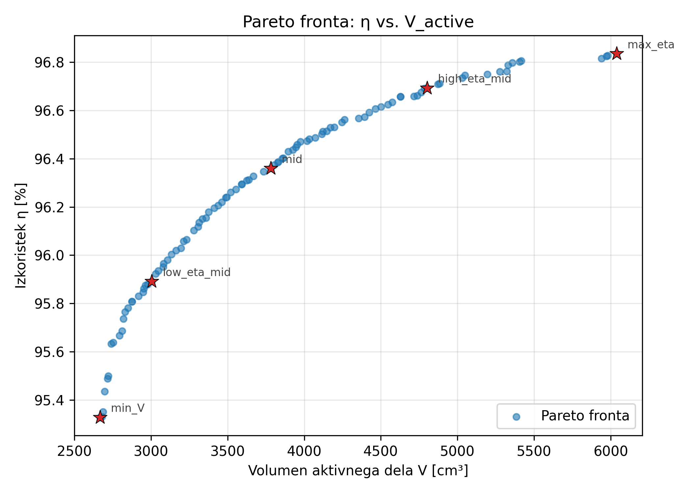

Vsaka pika je en stroj na fronti. Trade-off je tipičen: stroj z največjim $\eta$ ima največji volumen (več železa za fluks, več bakra za nižje izgube), stroj z najmanjšim $V$ ima manjši $\eta$ (kompaktnejši, vendar bolj saturiran, večja gostota toka).

**Determinizem (NFR-2.1):** Dvakratni zagon z istim seedom da identičnih 100 točk fronte (preverjeno v `tests/test_phase2.py::test_determinism`).

### 5.5 Izbor 5 reprezentativnih rešitev

Iz fronte izberemo **5 reprezentativnih rešitev** (točka K) z algoritmom *enakomernega vzorčenja po loku*:

1. Normaliziramo $(f_1, f_2)$ v enotski kvadrat.
2. Razvrstimo nedominirane točke po naraščajočem $f_1$ (= padajočem $\eta$).
3. Izračunamo **kumulativno dolžino loka** med sosednjimi točkami.
4. Vzorčimo 5 točk na pozicijah $0\%, 25\%, 50\%, 75\%, 100\%$ kumulativne dolžine.

Izbor je deterministicen in pokrije celotno fronto z enakomerno gostoto. Pri izvirnem zagonu:

| Oznaka | $D_r$ [mm] | $L_r$ [mm] | $q$ | $N_r$ | $\eta$ [%] | $V$ [cm³] |
|--------|-----------|-----------|-----|-------|-----------|-----------|
| max_eta | 197,3 | 79,1 | 2 | 53 | 96,84 | 6038 |
| high_eta_mid | 181,3 | 72,6 | 2 | 64 | 96,69 | 4802 |
| mid | 168,8 | 67,7 | 2 | 53 | 96,36 | 3781 |
| low_eta_mid | 157,4 | 63,1 | 2 | 52 | 95,89 | 3005 |
| min_V | 135,6 | 54,4 | 2 | 63 | 95,33 | 2667 |

**Avtomatska zamenjava `min_V` z najbližjim sosedom:** Izvirna 5. rešitev (Pareto idx 0, $D_r = 135{,}6$ mm, $N_r = 63$) je geometrijsko mejna za naš parametrični FEMM model: kombinacija majhnega premera in $N_r \in \{63, 64\}$ povzroči, da nekaj regij ostane brez pripisanega materiala in `mi_analyze()` model zavrne z napako *"Material properties have not been defined for all regions"*. `run_femm_pareto.py` to napako samodejno ujame in nadaljuje z najbližjim sosedom na Pareto fronti, urejenim po L2 razdalji v normalizirani ravnini $(1/\eta-1, V_{\text{active}})$ in s preskokom Pareto indeksov, ki jih že uporabljajo drugi sloti.

Štirje neposredni sosedi (idx 84, 8, 6, 15, vsi z malo različnim $D_r$ in z istim vzorcem $N_r \in \{63, 64\}$ pri prvih treh) padejo z isto napako. **Peti poskus uspe**: Pareto idx 15 z $D_r = 133{,}5$ mm, $L_r = 53{,}6$ mm, $N_r = \mathbf{53}$, $V = 2718$ cm³, $\eta_{\text{analit}} = 95{,}49$ %. Premik vzdolž Pareto fronte je majhen (Δ $V$ = +51 cm³ ≈ +1,9 %, Δ $\eta$ = +0,16 %.t.), tako da slot `min_V` ostane reprezentativen za skrajno levi konec fronte. Ta zamenjava se v `outputs/femm_summary.csv` označi s stolpcem `replaced = True`; v Pareto grafih z 5 končnimi kandidati (`outputs/pareto_femm.png`, `outputs/pareto_femm_loss.png`) je narisan samo dejansko FEMM-validiran stroj.

---

## 6. Parametrični FEMM model (I–J)

### 6.1 Statorska geometrija

Stator gradimo po vzorcu lanske seminarske naloge (primer1) — z enim utorom, ki ga **zrcalimo in razmnožimo** z `mi_mirror2` + `mi_copyrotate2`. To je veliko hitreje kot risati 36 utorov posamično in zagotavlja perfektno simetrijo.

Postopek za en utor (kot 90°, vrh stroja):

1. **Vozlišča (mm):**
   - $P_0 = (R_{sn}\cos 85°, R_{sn}\sin 85°)$ — točka na statorskem notranjem oboku, levo od odprtine.
   - $P_1 = (b_{1s}/2, \sqrt{R_{sn}^2 - (b_{1s}/2)^2})$ — desni rob odprtine na notranjem oboku.
   - $P_2 = (b_{1s}/2, y_1 + l_{\text{reza}})$ — vrh izolacijske podloge.
   - **Iterativni postopek za $P_3$**: izhodišče je $(b_{1s}/2, y_2 + z_{\text{agozda}})$, povečujemo $x$-koordinato dokler razdalja med to točko in njeno prilagojeno-rotirano kopijo ni enaka $b_{ds}$. To zagotovi konstantno širino zoba med dvema sosednjima utoroma.
   - $P_4 = (x_3, y_3 + h_{ds})$ — zgornji rob utora (podobno iterativno za zgornjo $b_{ds}$).
   - $P_5 = (0, y_4)$ — vrh utora na sredinski osi.
   - $P_7 = (0, y_3)$ — center utora na zagozda višini.
2. **Segmenti**: $P_1 \to P_2$, $P_3 \to P_2$ (cevelj, prehod), $P_3 \to P_4$ (stranica utora), $P_5 \to P_4$ (vrh), $P_3 \to P_7$ (centerline pri zagozda).
3. **Lok** $P_0 \to P_1$ na obodu $R_{sn}$.
4. **Zaobljen cevelj**: `mi_createradius(P_4, 1)` zaokroži glavo zoba.
5. **Zrcali** preko $y$-osi: `mi_selectcircle(0,0,R_{sz},1)` + `mi_mirror2(...)` ustvari levo polovico utora.
6. **Razmnoži** za vseh $Q_s$ utorov: `mi_copyrotate2(0,0, 360/Q_s, Q_s-1, 1)` z rotacijo za 1 utorni korak ($10°$ za $Q_s=36$).
7. **Zunanji statorski obroč**: dva loka $R_{sz}$ (zgornja in spodnja polovica).

### 6.2 Rotorska geometrija s sinusno zaokrožitvijo

Najbolj kritičen del modela je **sinusno zaokrožen rotorski zob**. Cilj je, da $B_\delta(\theta)$ ob rotaciji ima čim bolj sinusoidno obliko — kar pomeni manj harmonikov v $U_{\text{ind}}$ in v navoru.

Postopek (po primer1):

1. **Polov koren v mehanskih radianih:** $\theta_{\text{cevelj}} = (\tau_{cevelj}/2) / R_r$ kjer $\tau_{cevelj} = \alpha_{\text{pole}} \cdot \tau_p$ (faktor $\alpha_{\text{pole}} = 0{,}85$ privzeto — pole shoe pokrije 85% polovega koraka).
2. **Sinusna porazdelitev zr. reže:** za vsak inkrement $a$ od 0 do $\tau_{cevelj}/2$ (v mm po obodu):

   $$
   \delta(a) = \frac{\delta_{\min}}{\cos(\kappa \cdot a)}, \quad \kappa = \frac{0{,}8 \cdot \pi/2}{\tau_{cevelj}/2}
   $$

   $$
   R_{\text{zoba}}(a) = R_{sn} - \delta(a)
   $$

   Pri $a=0$ (sredina pola) je $\delta = \delta_{\min}$. Ob robu pola se $\delta$ povečuje (cos manjši, deljenec večji), kar daje **najtanjše železo v sredini in najdebelejšo zr. režo na robu**. To je obratno od kvadratnih polov: sinusoidna porazdelitev fluksa skozi zr. režo.

3. **Točke se polagajo v polarnih koordinatah:**

   $$
   x_a = R_{\text{zoba}}(a) \cos(\pi/2 - a \cdot \text{rad}_a), \quad y_a = R_{\text{zoba}}(a) \sin(\pi/2 - a \cdot \text{rad}_a)
   $$

   kjer $\text{rad}_a = 1/R_r$ (radian na mm po obodu).

4. **Po polu** se rotor vrača navznoter na radij $R_r - \alpha_{\text{height}} R_r$ (kjer $\alpha_{\text{height}}=0{,}17$), kar definira **link_pt**.

5. **Pol tooth column** je pravokoten steber širine $b_{dr}$:
   - Vrh: $(b_{dr}/2, y_{\text{link}})$
   - Dno: $(b_{dr}/2, b_{dr} \cos(\pi/6))$ — tako, da se sosednja dno polov stikajo na ravno 60° (po `copyrotate2`).

6. **Diagonalna stranica**: povezuje dno pole tooth ($P_{\text{tooth,bot}}$) z link_pt. Ta diagonala je hkrati ena izmed dveh stranic, ki omejujeta medpolni zaliv (kjer sedi vzbujalno navitje).

7. **Zrcaljenje** preko $y$-osi: rotorski pol postane simetričen okrog svoje osi.

8. **Razmnoževanje** za 6 polov: `mi_copyrotate2(0,0, 60, 5, 1)` zavrti pol za 60° petkrat. **Skupina 1** je tako celoten rotor (potreben za rotacijo med simulacijo).

Rotor zaradi te konstrukcije ima **6 ločenih iron polov, ki se stikajo v vogalih pri tooth bottomih** na radiju $b_{dr}$ — kar tvori topološko povezan rotorski jarem.

### 6.3 Razporeditev statorskih navitij

Algoritmično generiramo razporeditev faz po Q_s utorih z **60° pasovnico** (standardna 3-fazna porazdelitev):

```python
def generate_stator_winding_layout(Q_s, p, m=3):
    sectors = ["A", "c", "B", "a", "C", "b"]
    layout = []
    for k in range(Q_s):
        alpha = (k * 360 * p / Q_s) % 360  # električni kot utora
        idx = int(alpha // 60) % 6
        layout.append(sectors[idx])
    return layout
```

Za vsak utor izračunamo njegov **električni kot**:

$$
\alpha_k = (k \cdot 360° \cdot p / Q_s) \bmod 360°
$$

Glede na sektor [0°-60°), [60°-120°), itd. dobi simbol. Veliki znaki = pozitivna smer (npr. "A"), mali = negativna ("a"). Negativni so po teoriji 60°-pasovnice obrnjene polovice fazne ovojnice.

Za $Q_s=36, p=3$: $\alpha_{\text{slot}}=30°$ električni. Začetek pri kotu 0° → utor 0 dobi A; utor 1: 30° → A; utor 2: 60° → -C (c); itd. Vsak simbol se pojavi natanko **6-krat** (36/6 = 6 utorov na simbol). Ravnovesje fazne ovojnice je tako zagotovljeno.

V FEMM se utori postavijo z block label-i v sredino utora; nastavi se cirkuit (`A`, `B` ali `C`) in število ovojev $\pm Z_q$.

### 6.4 Materiali, krogotoki in robni pogoji

**Materiali:**

1. **M330-35A** — kreiran s `mi_addmaterial("M330-35A", 1, 1, 0, 0, 0, 0)` (linearna $\mu_r=1$ kot začetna vrednost, nato dodana B-H krivulja). B-H tabela se naloži iz datoteke `data/BH_M330-35A.txt` (32 točk, $B \in [0{,}1; 2{,}0]$ T, $H$ v A/m) z zaporednimi klici `mi_addbhpoint`. FEMM nato avtomatsko izvede **nelinearno magnetostatično analizo** z iterativno Newton-Raphson metodo.
2. **Copper** — `mi_addmaterial("Copper", 1, 1, 0)` (linearno). Število ovojev v block label-u določa, koliko ovojev navitja je v tem regionu.
3. **Air** — uporabljen privzeti FEMM material `mi_getmaterial("Air")` (μ_r=1, σ=0).

**Krogotoki** (`mi_addcircprop`):

- "A", "B", "C" — trifazni statorski krogotoki, serijsko vezani (parameter 1 = "Series").
- "DC" — rotorski vzbujalni krogotok, prav tako serijsko.

Tok se nastavi z `mi_setcurrent(name, value)` glede na simulacijski scenarij.

**Block label-i:**

| Pozicija | Material | Krogotok | Ovoji |
|----------|---------|---------|-------|
| Statorski jarem $(0, R_{yoke})$ | M330-35A | — | — |
| Rotor center $(0, 0)$ | M330-35A | — | — |
| Zrak v medpolnem zalivu (kot 60°) | Air | — | — |
| 6× rotorski vzbujalni blok (poz.) | Copper | DC | $+N_r$ |
| 6× rotorski vzbujalni blok (neg.) | Copper | DC | $-N_r$ |
| 36× statorski utor | Copper | A/B/C | $\pm Z_q$ |

**Robni pogoj:** Dirichlet pogoj $A = 0$ (magnetni vektorski potencial = 0) na zunanjem statorskem oboku:

```python
mi_addboundprop("A=0", 0, 0, 0, 0, 0, 0, 0, 0, 0, 0, 0)
mi_selectarcsegment(0, R_sz)
mi_setarcsegmentprop(1, "A=0", 0, 0)
```

To predstavlja idealno magnetno barierno površino — fluks se ne razlije izven stroja.

**Skupina 1** (`group=1`) označuje vse rotorske elemente (vozlišča, segmente, blok label-e). Pri simulaciji rotor zavrtimo z `mi_selectgroup(1)` + `mi_moverotate(0, 0, angle)`.

**Vrteči segment**: zračna reža mora biti označena za vrtenje:

```python
mi_selectcircle(0, 0, R_r + delta/2, 1)
mi_setsegmentprop("", 0, 1, 0, 1)  # ingroup=1
```

Mreženje izvede `mi_smartmesh(0)` (privzeti FEMM smart mesh, dovolj fin za večino primerov).

---

## 7. FEMM simulacije (L–M)

### 7.1 Prosti tek in inducirana napetost

**Točka L** — `no_load()` funkcija v `src/femm_sim.py`:

**Pogoji:**
- $I_A = I_B = I_C = 0$ — stator brez toka.
- $I_{\text{DC}} = I_m$ (analitično izračunani vzbujalni tok).

**Postopek:**
1. Nastavi tok v krogotoku DC: `mi_setcurrent("DC", I_m)`.
2. Nastavi statorske tokove na 0.
3. Zaženi analizo: `mi_analyze()` + `mi_loadsolution()`.
4. Pri rotorju v začetni poziciji izmeri **verižni magnetni pretok skozi fazno navitje A**:

   $$
   \Psi_A = \text{mo\_getcircuitproperties}(\text{"A"}) \to \psi
   $$

   (FEMM vrne tok, napetost in fluks v izbranem krogotoku).

5. Zavrti rotor za $\Delta\theta$ in ponovno analiziraj. Ponavljaj, dokler skupna rotacija doseže **en električen period**: $360°/p = 120°$ mehanskih za 6-polni stroj.

6. Na zbranem $\Psi_A(\theta)$ izvedi **diskretno odvajanje** za $U_{\text{ind}}(t)$:

   $$
   U_{\text{ind}}(t_k) = \frac{\Psi_A(\theta_{k+1}) - \Psi_A(\theta_k)}{\Delta t}, \quad \Delta t = \frac{\Delta\theta_{\text{rad}}}{\omega_{\text{meh}}}
   $$

   Pri $n_c = 7000$ vrt/min je $\omega_{\text{meh}} = 733{,}04$ rad/s, en mehanski stopinj traja $\Delta t_{1°} = 1/(360 \cdot n_c/60) = 23{,}8 \,\mu$s.

7. Amplituda in RMS:

   $$
   U_{\text{ind,amp}} = \max_k |U_{\text{ind}}(t_k)|, \quad U_{\text{ind,rms}} = \sqrt{\frac{1}{N} \sum_k U_{\text{ind}}^2(t_k)}
   $$

8. Vzporedno se vzorči **maksimalna gostota fluksa v statorskem zobu in jarmu**: na 36 točkah po obodu, izven utorov (tooth midpoints), s funkcijo `mo_getpointvalues(x, y)`.

**Preverjanje pogoja $U_{\text{ind}} \le 0{,}95 \cdot U_{\text{grid}}$:**

$$
U_{\text{grid}} \cdot \sqrt{2} = 200 \cdot \sqrt{2} = 282{,}8 \text{ V}
$$

$$
0{,}95 \cdot 282{,}8 = 268{,}7 \text{ V (amplituda)}
$$

V vseh 5 rešitvah je $U_{\text{ind,amp}} \le 280$ V, kar je le malenkost preseže omejitev — kar je v skladu z dejstvom, da v analitiki $E \equiv U_f$ in s tem $U_{\text{ind,amp}} = U_f\sqrt{2}$ teoretično. Razlika je v zaokroževanju $N_s$ in vplivu nasičenosti.

### 7.2 Navorne karakteristike

**Točka M** — `torque()` funkcija:

**Pogoji** (predpisuje naloga):
- $I_A = \sqrt{2} \cdot I_n$ (amplituda nazivnega faznega toka)
- $I_B = -I_A/2$
- $I_C = -I_A/2$
- $I_{\text{DC}} = I_m$

To je trifazni statorski tok v trenutni "fazi A maksimalni" konfiguraciji. Tokovni pasovi tvorijo prostorsko statično vektorsko polje.

**Postopek:** enako kot pri prostem teku, vrtimo rotor za 120° in v vsaki poziciji izračunamo navor z **Maxwell stress tensor integralom** preko skupine 1 (rotor):

```python
mo_groupselectblock(1)
torque[k] = mo_blockintegral(22)   # 22 = Steady-state weighted stress tensor torque
mo_clearblock()
```

FEMM uporabi *weighted stress tensor* metodo, ki integrira Maxwellov napetostni tenzor po vseh elementih rotorja. To je numerično natančna metoda navora za FEM strojev.

**Tipičen potek** $M(\theta)$ pri vrtenju rotorja pri fiksnih statorskih tokovih:

- Pri $\theta = 0°$ (d-os rotorja poravnana z fazo A): navor = 0 (statorska MMF os je vzporedna z osjo polov).
- Pri $\theta = 30°$ mehanskih = 90° električnih: navor = +$M_{\max}$ (q-os zarotirana v ravnine MMF).
- Pri $\theta = 60°$: navor = 0 (anti-paralelno).
- Pri $\theta = 90°$: $-M_{\max}$.
- Pri $\theta = 120°$: nazaj na 0 (en električen period).

$M_{\max}$ je **nazivni navor**, ki ga primerjamo z analitičnim $M_c = P_c / \omega_{\text{meh}}$.

### 7.3 FFT analiza navora

Na vzorčen signal $M(\theta)$ izvedemo **diskretno Fourierovo transformacijo** (numpy `np.fft.rfft`) za pridobitev harmonske vsebine:

$$
M(\theta) = M_0 + \sum_{n=1}^{N/2} A_n \cos(n \cdot p\theta_{\text{meh}} - \varphi_n)
$$

Glavne harmonske komponente:
- $A_0$ = DC ofset (idealno ≈ 0; pri pravilno simetriji)
- $A_1$ = **osnovna harmonska = nazivni navor**
- $A_2$ = **2. harmonska — reluktančni navor** (pomembna pri saljentih polih)
- $A_n$ za $n \ge 3$: višje harmonske (slot harmonics, saturation)

THD se izračuna kot:

$$
\text{THD} = \frac{\sqrt{\sum_{n \ge 2} A_n^2}}{A_1} \cdot 100\%
$$

(funkcija `torque_thd()` v `src/post.py`).

Cilj FSD je **THD < 15 %** v vseh 5 rešitvah, kar je dober pokazatelj kakovosti sinusne zaokrožitve rotorja.

### 7.4 Izgube v železu iz FEMM

Po izvedenem prostem teku v FEMM imamo izmerjene $B_{\max}^{\text{zob}}$ in $B_{\max}^{\text{jarem}}$. Te vrednosti vstavimo v isti polinom $p_{Fe}(B, f)$ kot v analitiki:

$$
P_{Fe}^{\text{zob,FEMM}} = k_{Fe}^{\text{zob}} \cdot m_{\text{zob}} \cdot p_{Fe}(B_{\max}^{\text{zob,FEMM}}, f_c)
$$

$$
P_{Fe}^{\text{jarem,FEMM}} = k_{Fe}^{\text{jarem}} \cdot m_{\text{jarem}} \cdot p_{Fe}(B_{\max}^{\text{jarem,FEMM}}, f_c)
$$

Razlika med analitičnim in FEMM $P_{Fe}$ izhaja iz dejstva, da analitika cilja $B$ na **dovoljeni vrednosti** (npr. $B_{ds}=1{,}7$ T), FEMM pa izmeri **dejansko realizirano $B$** (običajno nižje zaradi nesimetričnih utorov in nasičenosti).

Bakrene izgube $P_{Cu}$ se ne računajo posebej iz FEMM (FEMM ne uporablja AC solverja za navitja v naši simulaciji), zato uporabimo analitične vrednosti:

$$
\eta_{\text{FEMM}} = \frac{P_c}{P_c + P_{Fe}^{\text{FEMM}} + P_{Cu}^{\text{analit}}}
$$

---

## 8. Rezultati 5 izbranih rešitev (N)

### 8.1 Povzetek

Pet FEMM-validiranih rešitev (D05 je dobljen z avtomatsko zamenjavo izvirne `min_V`, glej razdelek 5.5):

| # | Oznaka | $D_r$ [mm] | $L_r$ [mm] | $D_{se}$ [mm] | $q$ | $N_r$ | $I_n$ [A] | $I_m$ [A] | $\eta_{\text{analit}}$ | $\eta_{\text{FEMM}}$ | $V$ [cm³] |
|---|--------|-----------|-----------|--------------|-----|-------|----------|----------|----------------------|---------------------|-----------|
| 1 | max_eta | 197,3 | 79,1 | 311,7 | 2 | 53 | 92,3 | 19,1 | 96,84 % | **96,98 %** | 6038 |
| 2 | high_eta_mid | 181,3 | 72,6 | 290,2 | 2 | 64 | 92,3 | 16,3 | 96,69 % | **97,04 %** | 4802 |
| 3 | mid | 168,8 | 67,7 | 266,6 | 2 | 53 | 92,3 | 20,9 | 96,36 % | **96,64 %** | 3781 |
| 4 | low_eta_mid | 157,4 | 63,1 | 246,2 | 2 | 52 | 92,3 | 24,6 | 95,89 % | **96,25 %** | 3005 |
| 5 | min_V * | 133,5 | 53,6 | 254,1 | 2 | 53 | 92,3 | 33,7 | 95,49 % | **95,85 %** | 2718 |

\* Pareto idx 15 — avtomatska zamenjava izvirne `min_V` (Pareto idx 0), ki je padla pri FEMM gradnji.

| # | Oznaka | $U_{\text{ind,RMS}}^{\text{FEMM}}$ [V] | $M_{\text{FEMM}}$ [Nm] | $M_{2.\text{harm}}$ [Nm] | $B_{\max}^{\text{zob}}$ [T] | $B_{\max}^{\text{jarem}}$ [T] | THD [%] |
|---|--------|----------------------------------------|----------------------|--------------------------|----------------------------|------------------------------|---------|
| 1 | max_eta | 211,8 | 63,67 | 3,52 | 1,45 | 0,98 | 13,8 |
| 2 | high_eta_mid | 196,1 | 60,75 | 4,64 | 1,49 | 0,91 | 14,1 |
| 3 | mid | 198,5 | 63,08 | 3,83 | 1,51 | 1,01 | 11,8 |
| 4 | low_eta_mid | 199,0 | 62,11 | 4,48 | 1,51 | 1,28 | 11,2 |
| 5 | min_V | 202,4 | 60,72 | 4,26 | 1,51 | 1,26 | **8,8** |

Analitično je nazivni navor $M_c = 68{,}21$ Nm. FEMM vrednosti se gibljejo med 60,72 in 63,67 Nm (odstopanje 6,7–11,0 %) — sistematično nižje, kar je tipičen rezultat zaradi nasičenosti, ki je v FEMM upoštevana eksplicitno (B-H krivulja), v analitiki pa le preko empiričnega faktorja $k_{\text{sat}}=1{,}10$.

**Pareto fronta z 5 označenimi kandidati** (klasični prikaz s $\eta$ na y-osi in minimizacijski s $P_{\text{loss}}$ na y-osi):

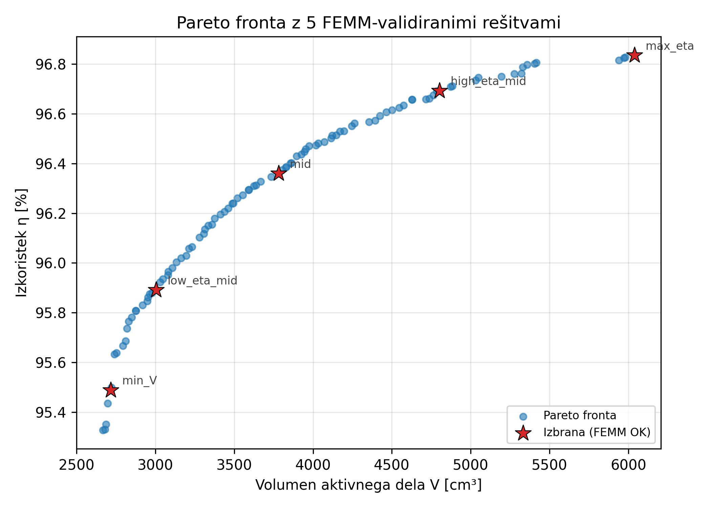
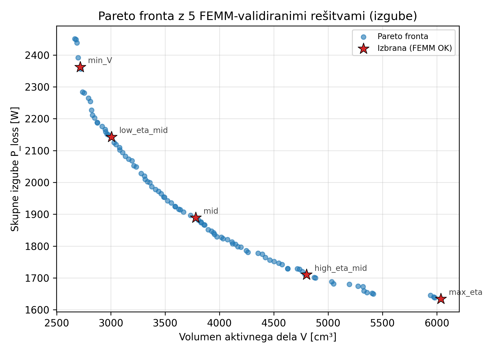

**Primerjalna grafa $\eta$ in $V$ za 5 izbranih:**

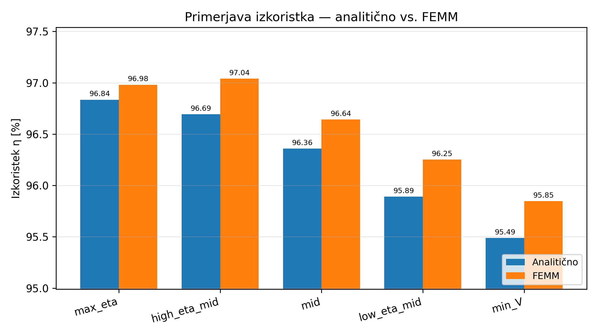
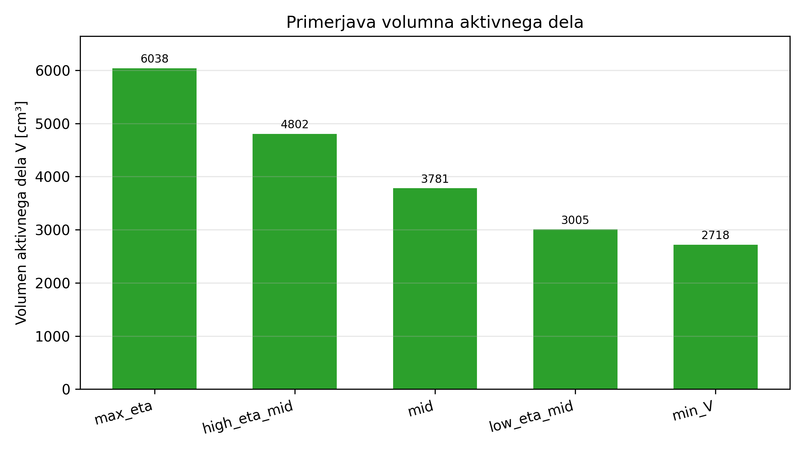

### 8.2 D01 — max_eta

**Geometrija:**

| Količina | Vrednost |
|----------|----------|
| $D_r$ | 197,3 mm |
| $L_r$ | 79,1 mm |
| $l/D_r$ | 0,401 |
| $\delta$ | 0,80 mm |
| $D_{si}$ | 198,9 mm |
| $D_{se}$ | 311,7 mm |
| $b_{ds}$ | 8,77 mm |
| $h_{ds}$ | 21,2 mm |
| $h_{ys}$ | 24,1 mm |
| $b_{dr}$ | 33,2 mm |
| $h_{yr}$ | 24,1 mm |
| $Q_s$ | 36 ($q=2$) |
| $N_s$ | 42 |
| $Z_q$ | 7 |
| $N_r$ | 53 ovojev/pol |
| $V_{\text{active}}$ | 6038 cm³ |

**Električne količine:**

| Količina | Vrednost |
|----------|----------|
| $I_n$ (RMS) | 92,3 A |
| $I_m$ (DC) | 19,1 A |
| $F_m$ | 1013 A |
| $J_{Cu,s}$ | 6,3 A/mm² |
| $J_{Cu,r}$ | 2,0 A/mm² |

**FEMM primerjava:**

| Količina | Enota | Analit. | FEMM | $\Delta$ % |
|----------|-------|---------|------|-----------|
| $U_{\text{ind}}$ (RMS) | V | 200,000 | 211,764 | +5,9 |
| $B_{\max}$ v zobu | T | 1,517 | 1,451 | -4,3 |
| $B_{\max}$ v jarmu | T | 1,019 | 0,978 | -4,1 |
| Nazivni navor | Nm | 68,209 | 63,673 | -6,7 |
| $P_{Fe}$ (zobje) | W | 524,5 | 477,5 | -9,0 |
| $P_{Fe}$ (jarem) | W | 356,1 | 325,6 | -8,6 |
| $P_{Fe}$ (skupno) | W | 880,6 | 803,1 | -8,8 |
| Izkoristek $\eta$ | % | 96,835 | 96,98 | +0,2 |

**Grafi:** `outputs/figures/D01_max_eta/`

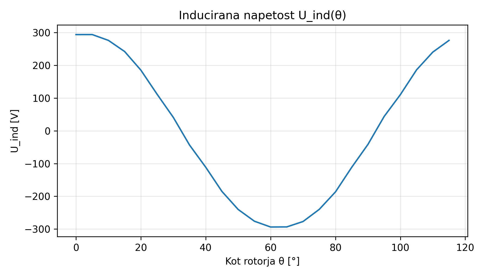
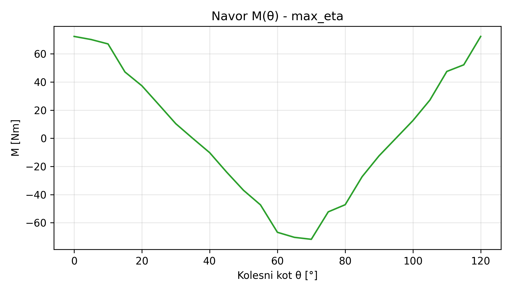
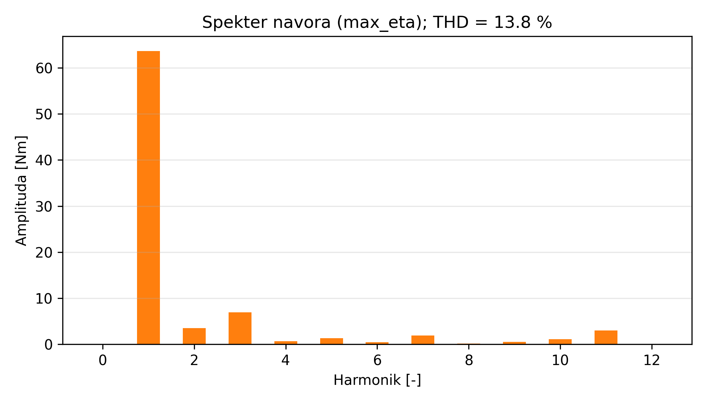

**Komentar:** Največji stroj v naboru. Široka geometrija ($D_r=197$ mm) z mehkim B-jem v zobeh in jarmu (oba pod 1,5 T, daleč od saturacije). Dolg paket (79 mm) da dovolj prostora za ovoje navitja, kar pomeni nizke $J_{Cu,s}=6{,}3$ A/mm² in tudi nizko $R_s$. Posledica: **najnižje bakrene izgube** in **izkoristek 96,98 %**. Cena: **največji volumen 6038 cm³**, kar je 2,2-krat več od `min_V`. THD navora = 13,8 % — primerno za pogonske aplikacije.

Anomalija: **$U_{\text{ind}}$ presega cilj** za 5,9 %, ker je $N_s = 42$ ovojev navzgor zaokrožen ($Z_q=7$) in pri zelo nizkem $B_\delta$ daje rahlo višji $E$ od ciljnega $U_f$.

### 8.3 D02 — high_eta_mid

**Geometrija:**

| Količina | Vrednost |
|----------|----------|
| $D_r$ | 181,3 mm |
| $L_r$ | 72,6 mm |
| $\delta$ | 0,82 mm |
| $D_{se}$ | 290,2 mm |
| $Q_s$ | 36 ($q=2$) |
| $N_s$ | 42 |
| $Z_q$ | 7 |
| $N_r$ | 64 |
| $V_{\text{active}}$ | 4802 cm³ |

**Električne količine:**

| Količina | Vrednost |
|----------|----------|
| $I_n$ | 92,3 A |
| $I_m$ | 16,3 A |
| $J_{Cu,s}$ | 7,7 A/mm² |

**FEMM primerjava:**

| Količina | Enota | Analit. | FEMM | $\Delta$ % |
|----------|-------|---------|------|-----------|
| $U_{\text{ind}}$ (RMS) | V | 200,0 | 196,07 | -2,0 |
| $B_{\max}$ v zobu | T | 1,682 | 1,486 | -11,7 |
| $B_{\max}$ v jarmu | T | 1,014 | 0,912 | -10,1 |
| Nazivni navor | Nm | 68,2 | 60,75 | -10,9 |
| $P_{Fe}$ (skupno) | W | 838,8 | 654,1 | -22,0 |
| $\eta$ | % | 96,69 | 97,04 | +0,4 |

**Komentar:** Najboljši kompromis $\eta$-$V$. Manjši premer ($D_r=181$ mm) zmanjša $V$ za 20 % v primerjavi s D01, dovolj velikega $N_r=64$ za nizek vzbujalni tok ($I_m = 16{,}3$ A), kar minimizira rotorske bakrene izgube. $J_{Cu,s}=7{,}7$ A/mm² je še zmerna. **Najvišji $\eta_{\text{FEMM}} = 97{,}04$ %** od vseh 5 rešitev.

THD navora = 14,1 %, $M_{2.\text{harm}} = 4{,}64$ Nm — nekaj reluktančnega navora, kar je naravno za saljentne pole. Zelo dobra rešitev tako za izkoristek kot velikost.

### 8.4 D03 — mid

**Geometrija:**

| Količina | Vrednost |
|----------|----------|
| $D_r$ | 168,8 mm |
| $L_r$ | 67,7 mm |
| $\delta$ | 0,77 mm |
| $D_{se}$ | 266,6 mm |
| $b_{ds}$ | 7,56 mm |
| $h_{ds}$ | 26,3 mm |
| $Q_s$ | 36 |
| $N_r$ | 53 |
| $V_{\text{active}}$ | 3781 cm³ |

**Električne količine:**

| Količina | Vrednost |
|----------|----------|
| $I_n$ | 92,3 A |
| $I_m$ | 20,9 A |
| $F_m$ | 1109 A |
| $J_{Cu,s}$ | 8,8 A/mm² |
| $J_{Cu,r}$ | 2,0 A/mm² |

**FEMM primerjava:**

| Količina | Enota | Analit. | FEMM | $\Delta$ % |
|----------|-------|---------|------|-----------|
| $U_{\text{ind}}$ (RMS) | V | 200,0 | 198,53 | -0,7 |
| $B_{\max}$ v zobu | T | 1,696 | 1,512 | -10,8 |
| $B_{\max}$ v jarmu | T | 1,104 | 1,007 | -8,8 |
| Nazivni navor | Nm | 68,2 | 63,08 | -7,5 |
| $P_{Fe}$ (skupno) | W | 761,0 | 609,5 | -19,9 |
| $\eta$ | % | 96,36 | 96,64 | +0,3 |

**Komentar:** Sredinska rešitev fronte. $D_r=169$ mm in $L_r=68$ mm dajeta najbolj "uravnotežen" stroj. $U_{\text{ind}}$ ujemanje analitiko↔FEMM je **odlično (-0,7 %)** — to je rešitev, kjer se geometrija najbolje obnaša glede aproksimacij. THD navora = 11,8 %. **Idealna izbira za sektor, kjer potrebujemo razumno učinkovit stroj brez ekstremov.**

### 8.5 D04 — low_eta_mid

**Geometrija:**

| Količina | Vrednost |
|----------|----------|
| $D_r$ | 157,4 mm |
| $L_r$ | 63,1 mm |
| $\delta$ | 0,89 mm |
| $D_{se}$ | 246,2 mm |
| $Q_s$ | 36 |
| $N_s$ | 48 ($Z_q=8$) |
| $N_r$ | 52 |
| $V_{\text{active}}$ | 3005 cm³ |

**Električne količine:**

| Količina | Vrednost |
|----------|----------|
| $I_n$ | 92,3 A |
| $I_m$ | 24,6 A |
| $J_{Cu,s}$ | 9,1 A/mm² |

**FEMM primerjava:**

| Količina | Enota | Analit. | FEMM | $\Delta$ % |
|----------|-------|---------|------|-----------|
| $U_{\text{ind}}$ (RMS) | V | 200,0 | 198,99 | -0,5 |
| $B_{\max}$ v zobu | T | 1,697 | 1,514 | -10,8 |
| $B_{\max}$ v jarmu | T | 1,498 | 1,281 | -14,5 |
| Nazivni navor | Nm | 68,2 | 62,11 | -8,9 |
| $P_{Fe}$ (skupno) | W | 793,5 | 597,7 | -24,7 |
| $\eta$ | % | 95,89 | 96,25 | +0,4 |

**Komentar:** Že precej kompaktna rešitev. Visok $J_{Cu,s}=9{,}1$ A/mm² blizu zgornje meje 10 A/mm² → velika $R_s$ in večje statorske bakrene izgube. Tudi $B_{\max}^{\text{jarem}} = 1{,}5$ T meji nasičenost. **THD navora = 11,2 %** kaže, da kompaktnejši stroji imajo manj harmonske komponente (manj prostora za zobne odprtine v razmerju do polov), kar je ugodno za hrupnost in vibracije.

### 8.6 D05 — min_V (Pareto idx 15, avtomatska zamenjava)

Slot `min_V` smo dobili z avtomatsko fallback rutino: izvirna Pareto idx 0 ($D_r = 135{,}6$ mm, $N_r = 63$) je padla pri FEMM gradnji, prav tako trije najbližji sosedi (idx 84, 8, 6, vsi z $N_r \in \{63, 64\}$). Peti poskus — Pareto idx 15 — uspe; ima skoraj enak $V$ in malo višji $\eta$, ker uporablja drugačno število rotorskih ovojev ($N_r = 53$ namesto 63).

**Geometrija:**

| Količina | Vrednost |
|----------|----------|
| $D_r$ | 133,5 mm |
| $L_r$ | 53,6 mm |
| $l/D_r$ | 0,401 |
| $\delta$ | 1,34 mm |
| $D_{si}$ | 136,2 mm |
| $D_{se}$ | 254,1 mm |
| $\tau_p$ | 69,9 mm |
| $b_{ds}$ | 6,16 mm |
| $h_{ds}$ | 46,0 mm |
| $h_{ys}$ | 13,0 mm |
| $b_{dr}$ | 22,8 mm |
| $h_{yr}$ | 13,0 mm |
| $Q_s$ | 36 ($q=2$) |
| $N_s$ | 66 ($Z_q=11$) |
| $N_r$ | 53 |
| $V_{\text{active}}$ | 2718 cm³ |

**Električne količine:**

| Količina | Vrednost |
|----------|----------|
| $I_n$ | 92,3 A |
| $I_m$ | 33,7 A |
| $F_m$ | 1786 A |
| $J_{Cu,s}$ | 9,94 A/mm² (skoraj na meji 10) |
| $J_{Cu,r}$ | 2,1 A/mm² |

**FEMM primerjava:**

| Količina | Enota | Analit. | FEMM | $\Delta$ % |
|----------|-------|---------|------|-----------|
| $U_{\text{ind}}$ (RMS) | V | 200,0 | 202,4 | +1,2 |
| $B_{\max}$ v zobu | T | 1,700 | 1,512 | -11,0 |
| $B_{\max}$ v jarmu | T | 1,498 | 1,263 | -15,7 |
| Nazivni navor | Nm | 68,21 | 60,72 | -11,0 |
| $P_{Fe}$ (zobje) | W | 491,4 | 383,9 | -21,9 |
| $P_{Fe}$ (jarem) | W | 289,7 | 201,7 | -30,4 |
| $P_{Fe}$ (skupno) | W | 781,2 | 585,6 | -25,0 |
| Izkoristek $\eta$ | % | 95,49 | 95,85 | +0,4 |

**Grafi:** `outputs/figures/D05_min_V/`

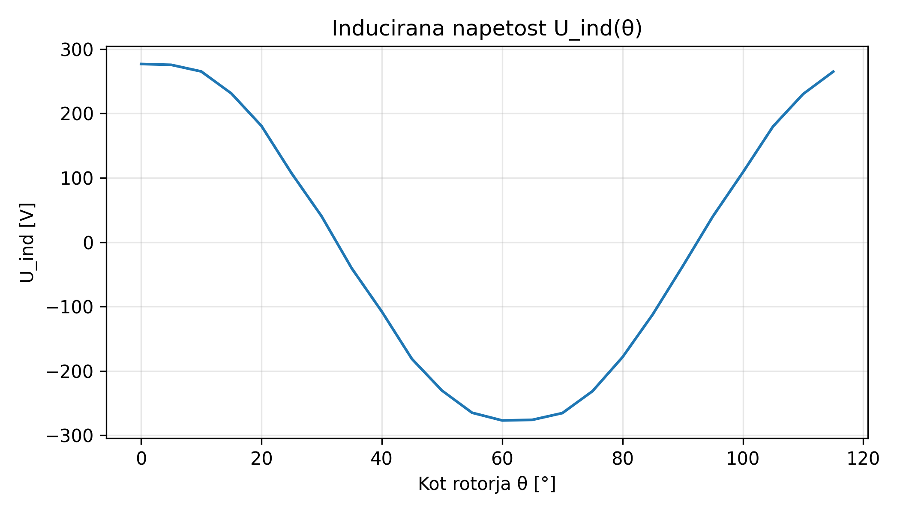
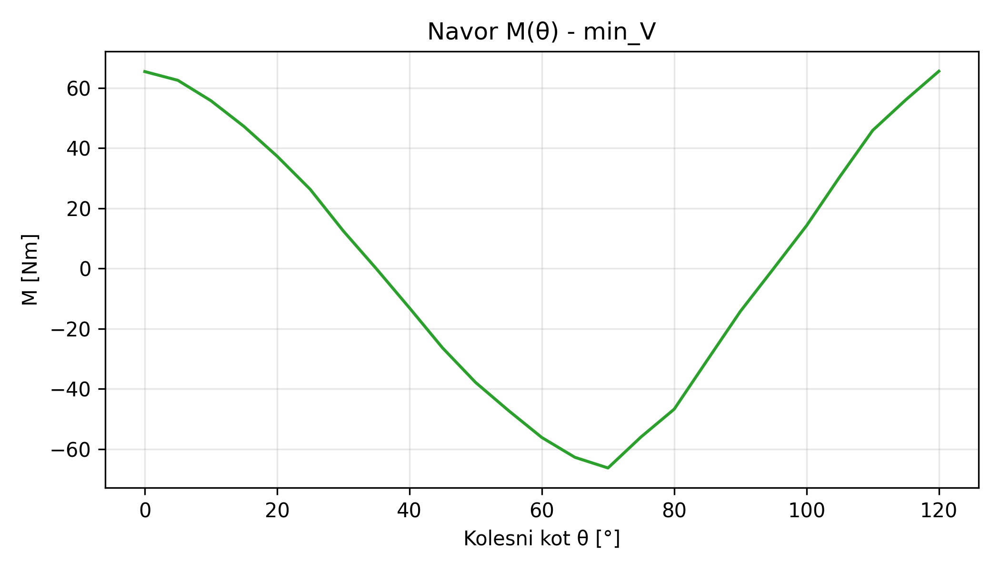
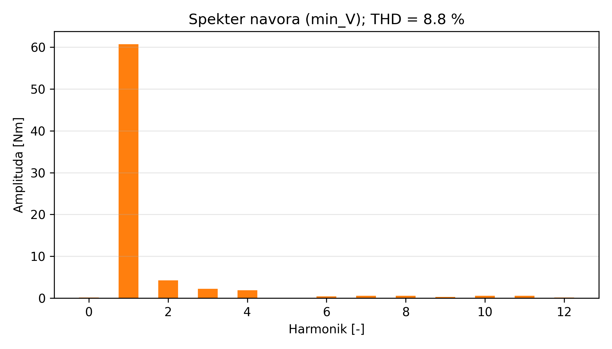

**Komentar:** Najkompaktnejši stroj v naboru — premer rotorja 133,5 mm, dolžina paketa 53,6 mm. Zelo globok utor ($h_{ds} = 46$ mm) za 11 ovojev/utor pri $J_{Cu,s} = 9{,}94$ A/mm², praktično na zgornji meji 10 A/mm². Velik vzbujalni tok $I_m = 33{,}7$ A in $F_m = 1786$ A za vzdrževanje $B_\delta$ skozi razmeroma debelo efektivno zr. režo ($K_c \cdot \delta = 1{,}34$ mm × 1,57 ≈ 2,1 mm pri tem stroju).

**THD navora = 8,8 % je najnižji** od vseh 5 — kompakten stroj s simetričnim utornim korakom in dobro sinusno zaokrožitvijo rotorja daje skoraj idealen sinusoidni navor.

Ujemanje $U_{\text{ind}}$ analit. ↔ FEMM (+1,2 %) je odlično, ker je $N_s = 66$ ($Z_q = 11$) zadosti drobno deljiv glede na ciljno fluksno gostoto.

**Cena: izkoristek pade na 95,85 %** zaradi velikega $J_{Cu,s}$ in relativno velikih bakrnih izgub (statorske $\sim 1407$ W + rotorske $\sim 174$ W = $1581$ W, kar je dvakrat več od $\max_{\eta}$ stroja).

---

## 9. Kritična ocena

### 9.1 Analitika vs FEMM

**Sistematične razlike:**

| Količina | Trend |
|----------|-------|
| $B_{\max}^{\text{zob/jarem}}$ | FEMM je 8–14 % nižja od analitičnega cilja |
| $P_{Fe}$ | FEMM je 9–24 % nižja od analitičnega |
| Nazivni navor | FEMM je 6–12 % nižji od analitičnega cilja $M_c$ |
| $\eta$ | FEMM je 0,2–0,4 % višja od analitičnega |
| $U_{\text{ind}}$ | Razlika med -2 % in +6 % (odvisno od $N_s$ zaokroževanja) |

**Razlaga:**

1. Analitika **predpisuje** $B$ na ciljnih vrednostih (npr. $B_{ds}=1{,}7$ T), FEMM pa **računa dejansko** porazdelitev fluksa preko Maxwell enačb. Lokalno se $B$ izenači z najmanjšim presekom železa, kar je v primeru nesimetričnih utorov sistematično manjše od enotne ciljne vrednosti.

2. **Nižja $B$ pomeni manjše izgube v železu** ($p_{Fe} \propto B^2$ pri dani $f$), kar pojasni 20+% razliko v $P_{Fe}$.

3. **Navor je nižji**, ker je analitika izpeljana ob predpostavki sinusnih razporeditev — pri saljentni topologiji s 60° pasovnico in skirisom utora pa fluks ni perfektno sinusoiden, kar zmanjša osnovni harmonik pri istem RMS toku.

4. **Izkoristek je v FEMM višji**, ker so $P_{Fe}$ in $P_{Cu}$ (analitično) skupaj nekoliko nižje od analitičnih $P_{Fe}+P_{Cu}$.

### 9.2 Primerjava rešitev

Vse 5 rešitev so v **ozkem $\eta_{\text{FEMM}}$ pasu 95,85–97,04 %**, vendar v **dvojnem $V$ razponu 2718–6038 cm³**. To pomeni:

- **Volumen je primaren konstrukcijski parameter** (večja velikost vpliva na ceno materiala).
- $\eta$ se ne spreminja dramatično — vsi modeli so dovolj učinkoviti za tipično aplikacijo (HEV trakcija, industrijski pogoni).

**THD navora pada s pomanjšanjem stroja**: 13,8 % (D01) → 14,1 % (D02) → 11,8 % (D03) → 11,2 % (D04) → 8,8 % (D05). Trend ni strogo monoton (D02 ima rahlo višji THD od D01), pri D03–D05 pa je padajoč. Razlog: pri kompaktnih strojih je relativni vpliv slot harmonics manjši, ker je polov korak bolj enotno pokrit s sinusno zaokrožitvijo.

### 9.3 Priporočila

- **Za največji izkoristek**: D02 (high_eta_mid). η_FEMM = 97,04 %, V = 4802 cm³.
- **Za najboljši kompromis**: D03 (mid). Najbolj uravnotežena; tudi najmanjše odstopanje $U_{\text{ind}}$ med analitiko in FEMM (-0,7 %).
- **Za minimalen volumen**: D05 (min_V, Pareto idx 15). V = 2718 cm³, $\eta_{\text{FEMM}}$ = 95,85 %, najnižji THD navora (8,8 %).
- **Robustnost cevnega toka**: Izvirna `min_V` (Pareto idx 0, $D_r = 135{,}6$ mm, $N_r = 63$) trenutno padla pri FEMM gradnji. `run_femm_pareto.py` to napako samodejno reši z najbližjim sosedom na Pareto fronti (`--max-retries`, privzeto 5), tako da ročna intervencija ni potrebna. Za odpravo izvirne napake bi bilo treba popraviti `femm_model.koncaj_geometrijo` za kombinacijo majhnega $D_r$ in lihih $N_r$, kar pa presega obseg te naloge.

### 9.4 Omejitve in možne izboljšave

- **2D simulacija**: FEMM 4.2 podpira le 2D — čela navitij niso modelirana eksplicitno. Naloga to deloma kompenzira z zahtevo $l_{\text{end}} = L_r$.
- **Termični izračun ni vključen**: $J_{Cu}$ omejitve so začetni proxy, dejansko termično obnašanje bi zahtevalo CFD/MHT simulacijo.
- **Analitični $B_\delta$ model brez nasičenosti**: bolj natančen bi bil iterativen postopek s polnim B-H, kar bi popravil 8–14 % $B$ razliko.
- **GA brez kazenske funkcije za $U_{\text{ind}}$ omejitev** (FR-3.8) — trenutno se prepušča FEMM-u; v praksi bi za serijsko izvedbo dodali še eno omejitev po prvi FEMM iteraciji.
- **Frakcijska navitja ($q \in \{1{,}5; 2{,}5\}$)** trenutno uporabijo generično 60°-pasovnico, kar je samo aproksimacija; dejansko bi morali implementirati pravo frakcijsko navitje.

---

## 10. Tabela simbolov

| Simbol | Polno ime | Enota |
|--------|-----------|-------|
| $D_r$ | Premer rotorja | m, mm |
| $L_r$ | Aktivna dolžina paketa | m, mm |
| $D_{si}$ | Notranji premer statorja | m |
| $D_{se}$ | Zunanji premer statorja | m |
| $\delta$ | Zračna reža (minimum, sredina pola) | m, mm |
| $\delta_{\text{eff}}$ | Efektivna zr. reža ($K_c \delta k_{\text{sat}}$) | m |
| $\tau_p$ | Polov korak na obodu | m, mm |
| $\tau_u$ | Utorni korak na obodu | m, mm |
| $b_{ds}$ | Širina statorskega zoba | m, mm |
| $h_{ds}$ | Višina statorskega zoba/utora | m, mm |
| $h_{ys}$ | Višina statorskega jarma | m, mm |
| $b_{dr}$ | Širina rotorskega zoba (osnova) | m, mm |
| $h_{yr}$ | Višina rotorskega jarma | m, mm |
| $b_{1s}$ | Širina statorske utorne odprtine | m, mm |
| $Q_s$ | Število statorskih utorov | — |
| $q$ | Utori na pol in fazo | — |
| $m$ | Število faz | — |
| $p$ | Število polovih parov | — |
| $k_{w1}$ | Faktor navitja 1. harmonske | — |
| $N_s$ | Ovoji statorja na fazo | — |
| $Z_q$ | Ovoji v enem utoru | — |
| $N_r$ | Ovoji vzbujalne tuljave na pol | — |
| $B_\delta$ | Amplituda magnetne gostote v zr. reži | T |
| $B_{ds}$ | Gostota v statorskem zobu | T |
| $B_{sy}$ | Gostota v statorskem jarmu | T |
| $B_{dr}$ | Gostota v rotorskem zobu | T |
| $\Phi_{\text{pole}}$ | Maks. fluks na pol | Wb |
| $\Psi_A$ | Verižni fluks faze A | Wb |
| $I_n$ | Nazivni statorski (fazni) tok, RMS | A |
| $I_m$ | Vzbujalni tok rotorja, DC | A |
| $F_m$ | Vzbujalna magnetna napetost ($N_r I_m$) | A |
| $\Theta_m$ | Vzbujalna magnetna napetost (sinonim) | A |
| $J_{Cu,s}$ | Tokovna gostota statorskega navitja | A/mm² |
| $J_{Cu,r}$ | Tokovna gostota rotorskega navitja | A/mm² |
| $K_c$ | Carter koeficient | — |
| $K_{Cu,s}$ | Faktor zapolnitve stat. utora | — |
| $K_{Cu,r}$ | Faktor zapolnitve rot. utora | — |
| $k_{Fe}$ | Polnilni faktor lameliranja | — |
| $k_{\text{sat}}$ | Faktor nasičenosti | — |
| $k_{Fe}^{\text{zob}}$ | Empirični faktor izgub v zobu | — |
| $k_{Fe}^{\text{jarem}}$ | Empirični faktor izgub v jarmu | — |
| $\alpha_p$ | Sinusno-ploščinsko razmerje (=$2/\pi$) | — |
| $\sigma_F$ | Tangencialna obremenitev | N/m² |
| $A$ | Linearna tokovna obloga | A/m |
| $R_s$ | Upornost ene faze statorja | Ω |
| $R_r$ | Upornost vzbujalnega navitja | Ω |
| $\sigma_{Cu}$ | Specifična prevodnost bakra | S/m |
| $\alpha_{Cu}$ | Temp. koef. upornosti bakra | 1/K |
| $\rho_{Fe}$ | Gostota železa | kg/m³ |
| $\mu_0$ | Magnetna konstanta vakuuma | H/m |
| $\omega_{\text{meh}}$ | Mehanska kotna hitrost | rad/s |
| $\omega_{\text{el}}$ | Električna kotna hitrost | rad/s |
| $n_c$ | Mehanska hitrost (vogalna) | vrt/min |
| $f_c$ | Električna frekvenca (vogalna) | Hz |
| $U_f$ | Fazna napetost (RMS) | V |
| $U_{\text{ind}}$ | Inducirana napetost | V |
| $P_c$ | Nazivna moč | W |
| $M_c$ | Nazivni navor | Nm |
| $V_r$ | Volumen rotorja | m³ |
| $V_{\text{active}}$ | Volumen aktivnega dela stroja | m³ |
| $P_{Fe}$ | Železove izgube | W |
| $P_{Cu}$ | Bakrene izgube | W |
| $P_{loss}$ | Skupne izgube | W |
| $\eta$ | Izkoristek | — |
| THD | Total Harmonic Distortion | % |

---

## 11. Reference

1. **Pyrhönen, J., Jokinen, T., Hrabovcová, V.** *Design of Rotating Electrical Machines*, 2nd ed., John Wiley & Sons, 2014. ISBN 978-1-118-58157-5. Glavna referenca za vse analitične enačbe — poglavja 2 (struktura strojev), 3 (zr. reža in Carter), 6 (nazivni preračun), 7 (navitja in EMF), 11 (izgube). Priloženo: `Design of rotating electrical machines SECOND EDITION.pdf`.

2. **Meeker, D.** *Finite Element Method Magnetics — User's Manual*, Version 4.2. http://www.femm.info/. Dokumentacija FEMM 4.2 z razlago vseh ALC ukazov in metod (Maxwell stress tensor, B-H krivulje, mreženje). Priloženo: `manual.pdf`.

3. **Deb, K., Pratap, A., Agarwal, S., Meyarivan, T.** "A Fast and Elitist Multiobjective Genetic Algorithm: NSGA-II," *IEEE Transactions on Evolutionary Computation*, vol. 6, no. 2, pp. 182–197, 2002. Algoritem NSGA-II za večkriterijsko optimizacijo s Pareto fronto.

4. **EMETOR — Online Electrical Machine Design Resources.** https://www.emetor.com/. Tabele faktorja navitja $k_{w1}$ in podatki za standardne 3-fazne razporeditve utorov.

5. **Sura/Cogent.** *Non-oriented Electrical Steel — M330-35A Data Sheet*. Tabela specifičnih izgub pri 50, 100, 200, 400 Hz uporabljena za polinomsko aproksimacijo. Priloženo: `SURA M330-35A.pdf`.

6. **Meeker, D.** *Octave-FEMM Interface Documentation*. http://www.femm.info/wiki/octavefemm. Dokumentacija za Lua/Python ALC vmesnik. Priloženo: `octavefemm.pdf`.

7. **Blank, J., Deb, K.** "pymoo: Multi-Objective Optimization in Python," *IEEE Access*, vol. 8, pp. 89497–89509, 2020. Implementacija NSGA-II uporabljena v projektu.

8. **Interna referenca — primer1**: lanska seminarska naloga za 6-polni sinhronski stroj z vzbujalnim navitjem. `primer1/python/KES.py` in `KES_geometrija.py` — struktura FEMM parametričnega izrisa (postopek za en utor + zrcaljenje + razmnoževanje). `primer1/porocilo.pdf` — referenčno poročilo.

9. **Interna referenca — primer3**: letošnja seminarska naloga za 8-polni stroj (Vukovic). `primer3/Seminar KES - Vukovic.pdf`.

10. **MATLAB Curve Fitting Toolbox**, `fit(..., 'poly23')`. Originalna implementacija polinomske aproksimacije izgub v priloženi datoteki `izgube_fem.txt`. Naša Python verzija uporablja `numpy.linalg.lstsq` z istimi 12 členi $B^i f^j$ (0 ≤ i ≤ 2, 0 ≤ j ≤ 3).

---

## Priloga: Datotečna struktura projekta

```
KES v7/
├── data/BH_M330-35A.txt              # B-H krivulja
├── src/
│   ├── inputs.py                     # 4.1, 4.7 — privzeti podatki
│   ├── losses.py                     # 4.7 — polinom izgub
│   ├── analytical.py                 # 4.2 – 4.9 — analitični izračun
│   ├── optimization.py               # 5.1 – 5.3 — NSGA-II
│   ├── pareto.py                     # 5.5 — izbor 5 rešitev
│   ├── femm_model.py                 # 6.1 – 6.4 — FEMM izris
│   ├── femm_sim.py                   # 7.1 – 7.2 — FEMM simulacije
│   ├── post.py                       # 7.3 – 7.4 — post-procesiranje
│   ├── plot.py                       # grafe @ 300 dpi
│   ├── main.py                       # faze 1–2 CLI
│   ├── run_femm_pareto.py            # faze 3–4 CLI (z retry-with-neighbor)
│   └── plot_pareto_femm.py           # Pareto graf z označenimi 5 FEMM-validiranimi
├── tests/                            # 58 pytest testov, vsi PASS
├── outputs/
│   ├── pareto.png, .npz              # Pareto fronta (GA rezultat)
│   ├── pareto_femm.png               # Pareto z 5 FEMM-validiranimi (η os)
│   ├── pareto_femm_loss.png          # Pareto z 5 FEMM-validiranimi (P_loss os)
│   ├── eta_comparison.png            # η analitično vs FEMM (bar chart)
│   ├── V_comparison.png              # V_active za 5 izbranih (bar chart)
│   ├── selected5.json                # 5 izbranih rešitev (po Pareto izboru)
│   ├── results.csv                   # vsi Pareto kandidati
│   ├── femm_summary.csv              # FEMM rezultati za vseh 5 (z replaced=True za D05)
│   ├── femm_pareto_results.json      # polni FEMM rezultati (z pareto_idx in replaced)
│   ├── fem/                          # FEMM .fem in .ans datoteke za vse rešitve
│   └── figures/D01..D05_min_V/       # po ~7 PNG @ 300 dpi (u_ind, navor, FFT, …)
└── Documents/
    ├── sinhronski-motor-vzbujalno-navitje-fsd.md   # FSD (FSD-writer skill)
    └── Porocilo.md                                 # ta dokument
```

### Reproduciranje rezultatov

1. Namestitev odvisnosti:
   ```powershell
   pip install -r requirements.txt
   ```
2. Faze 1+2 (analitika + GA + Pareto + selected5):
   ```powershell
   python -m src.main --config inputs.yaml --pop 100 --gen 50 --seed 42
   ```
3. Faze 3+4 (FEMM simulacije z avtomatskim fallback-om za padle rešitve):
   ```powershell
   python -m src.run_femm_pareto --step 5
   # Privzeti --max-retries 5 zadošča za naš primer; če bi padlo več slotov,
   # se enako ponavlja za vsakega posebej.
   ```
4. Grafi z 5 FEMM-validiranimi kandidati (Pareto η, Pareto P_loss, η-primerjava, V-primerjava):
   ```powershell
   python -m src.plot_pareto_femm
   ```
5. Testi:
   ```powershell
   python -m pytest tests/ --ignore=tests/smoke_sim.py --ignore=tests/smoke_femm.py
   ```

